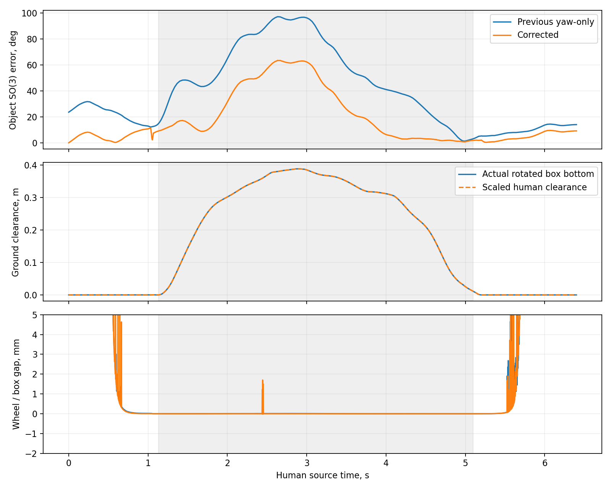
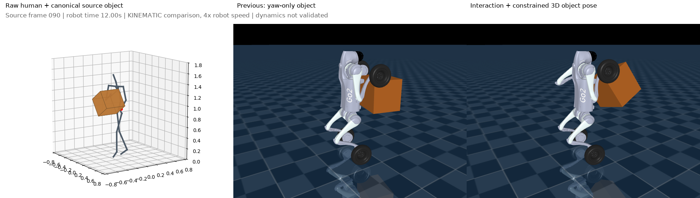
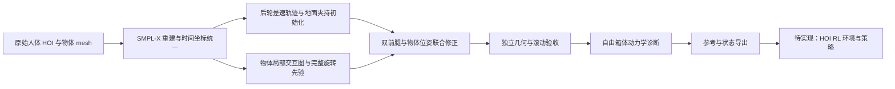

# PedHOI：Human HOI → Bi-wheel Ped Mimic Retarget

将人类与物体交互数据重定向到双后轮站立的 Unitree Go2W：双前腿在关键拿放阶段模仿人类操作，搬运阶段双前轮侧向夹持箱体、双后轮滚动移动。目标是为后续 pedipulation 强化学习提供保留物体交互语义、满足本体几何与滚动约束的参考。

**当前版本：单序列运动学参考通过，负载动态执行尚未通过，尚未训练 RL 策略。** 对照视频是运动学回放，不能作为真实抓取成功的证明。当前参考值得用于单序列 HOI RL 可学性实验，但不能直接导入原有机器人动作跟踪环境。

## 1. 当前范围与结果

已适配原始 OMOMO `sub16_largebox_010`，覆盖地面接近 → 双侧夹持 → 抬起 → 双轮搬运 → 地面放下 → 松开。输入直接来自人体 SMPL-X 和物体轨迹，不经过 G1 关节动作。OmniRetarget 的同序列数据用于物体坐标审计，交互网格思想用于物体约束修正。

| 项目 | 当前结果 |
|---|---|
| 人体参考 | 193 帧，30 Hz，6.4 s |
| 机器人参考 | 3073 帧，120 Hz，25.6 s；4 倍时间缩放 |
| 箱体 | 0.24 × 0.32 × 0.26 m；质量 0.5 kg 为实验假设 |
| 夹持阶段物体旋转误差 RMS | 60.93° → 33.50°；仍有明显本体适配误差 |
| 双侧夹持保守间隙峰值 | 1.70 mm |
| 后轮接触速度残差峰值 | 0.813 mm/s，仅针对参考轨迹 |
| 起止旋转箱底高度 | 均为 0 m |
| 关节限位 / 几何碰撞 / 四元数检查 | 通过当前阈值 |
| 回归测试 | 完整本地样例 9 项通过 |
| 自由箱体闭环测试 | 4.752 s 触发 `box_lost`，未完成 25.6 s 全程 |

动态测试使用自由基座、自由箱体和有界力矩，无焊接、mocap、根部外力或逐帧状态重设。当前控制器是平衡 LQR、关节 PD 与近似负载/夹持前馈，没有物体反馈。该测试中右侧平均接触法向力为 0，尚未建立持续双侧夹持；`box_lost` 指箱体相对位置误差超过阈值，不等同于已经观察到箱子落地。

**旧控制器失败不证明 RL 不可学习，也不要求传统控制器先完成全过程。** 当前 `training_ready=false` 保守记录接口和动态验收尚未完成；几何接近亦不代表接触力足够。

结果快照：[验收报告](docs/results/omomo_largebox/acceptance.json)、[物理测试](docs/results/omomo_largebox/physics_report.json)、[物体优化](docs/results/omomo_largebox/retarget_report.json)。这些是版本快照，不会随新运行自动更新。





## 2. 工作流与算法



- **轮足适配：** 搬运阶段不复制人体步态；使用后轮差速路径和积分轮相位。物体修正阶段固定基座与双后腿/轮，防止修夹持时破坏滚动约束。
- **交互图：** 在物体坐标系构造 6 个人体节点与 8 个箱角的 Delaunay 图，使用 uniform Laplacian 残差约束机器人与物体的相对关系。
- **物体修正：** 联合优化双前腿 6 个关节、物体旋转与平面位置；用完整 SO(3) 先验替代仅 yaw 的箱体姿态。当前旋转预算 35°、平面修正 ±6 cm，是实验参数而非硬件能力认证。
- **地面拿放：** 根据旋转后箱体支撑高度计算箱底，保留缩放后的人类离地曲线；末端夹持点适配到可达箱角，不能解释为精确复现人手位置。
- **独立验收：** 用实际轮碰撞几何检查间隙、相反箱侧接触法线、穿透、限位、箱底及后轮无滑动残差。对“距离标量为零但最近点不重合”的边界采用保守距离。

结合的是 [OmniRetarget](https://omniretarget.github.io/) 的交互表示思想；本项目使用独立的 SciPy least-squares 实现，**没有直接运行官方 G1 SQP 求解器**，也未继承其成功率。更多公式、阶段说明和来源见 [WORKFLOW.md](WORKFLOW.md)。

## 3. 目录结构

```text
PedHOI/
├── configs/omomo_largebox_go2w.json  # 本机已验证配置
├── pedhoi/                         # 主工作流、优化、验证、导出与渲染
├── experiments/                    # 历史实验代码；部分初始化被主流程复用
├── tests/test_workflow.py           # 表示测试与样例产物测试
├── docs/results/omomo_largebox/     # 本次验收报告与静态预览快照
├── requirements.txt                # 主环境已验证数值依赖版本
├── WORKFLOW.md                     # 算法与数据约定详解
└── runs/                           # 运行时生成，Git 忽略
```

`experiments/human_biwheel/retarget.py`、`human_ground_clamp/build.py` 和 `physics_check.py`、`resmimic_rolling_v2/build_reference.py` 是当前流程的实际依赖，不能只复制 `pedhoi/`。其他历史实验记录探索过程，并非全部具有可移植的一键入口。

## 4. 环境与外部数据

主环境本地验证使用 Python 3.13、MuJoCo 3.6；确切数值库版本见 `requirements.txt`。人体解析独立使用配置中的 `human_python`（本机为 Python 3.10 的 `gmr` 环境），需要 NumPy、joblib、PyTorch、smplx。渲染使用 EGL 与 imageio/FFmpeg，需要可用的 EGL 环境。

```bash
# 在 PedHOI 目录下，使用准备好的主 Python 环境
python -m pip install -r requirements.txt
```

人体环境中的 PyTorch 应按目标机器安装；将其解释器路径填入 `human_python`。此版本未提供自动下载数据或模型的安装器。

| 配置字段 | 所需资源 |
|---|---|
| `raw_omomo` | OMOMO 原始 `test_diffusion_manip_seq_joints24.p`，含目标序列 |
| `smplx_models` | body_models 根目录，下有 `smplx/SMPLX_*.npz` |
| `human_python` | 可导入 torch、smplx、joblib 的 Python 解释器 |
| `robot_xml` | 原项目 `GMR/assets/unitree_go2w/go2w.xml` 与其全部 mesh |
| `source_mesh` | OMOMO `largebox_cleaned_simplified.obj` |
| `omni_reference` | OmniRetarget `robot-object/sub16_largebox_010_original.npz` |
| `omni_mesh` | OmniRetarget `models/largebox/largebox.obj` |
| `holosoma_root` | 本地官方实现位置，用于来源记录 |

原始数据、SMPL-X 模型、第三方模型以及中间 NPZ/视频未提交；最终重定位 NPZ 已提供下载，见下方。请按各来源的访问与许可要求自行准备；本次提交不授予这些资源的再分发许可。

**可移植性限制：** 配置保留本机绝对路径。初始化辅助代码与物理脚本还硬编码了 `/home/robotennis2025/SJTU-BipedGo2w/GMR/assets/unitree_go2w/go2w.xml`；入口会检查配置与辅助代码模型路径一致。异机部署需同时修改 `experiments/resmimic_rolling_v2/build_reference.py` 的 `MODEL`、`experiments/human_ground_clamp/physics_check.py` 的模型路径和配置。不能只改 JSON 就假定已经可运行。

## 5. 运行与验证

```bash
cd /home/robotennis2025/SJTU-BipedGo2w/PedHOI
OPENBLAS_NUM_THREADS=1 python -m pedhoi.run --config configs/omomo_largebox_go2w.json

# 顺序执行：等工作流完成后再读写产物或跑完整测试
python -m unittest discover -s tests -v

# 复用来源、代码、配置及产物指纹一致的阶段
OPENBLAS_NUM_THREADS=1 python -m pedhoi.run --config configs/omomo_largebox_go2w.json --resume

# 无需渲染时
OPENBLAS_NUM_THREADS=1 python -m pedhoi.run --config configs/omomo_largebox_go2w.json --resume --skip-render
```

新机器可先复制配置为 `configs/omomo_largebox_go2w.local.json` 再改路径，并将上面的 `--config` 指向该文件。当前入口仅允许已校准序列、帧率、时间缩放、箱体尺寸和质量；换数据需要重新适配接触窗口和初始化。

退出码：正常完成且运动学通过为 `0`，**不表示动力学成功**；`--require-dynamics` 在当前版本返回 `3`。依赖或阶段执行错误会抛异常，详情查看输出目录 `logs/`。不应并行运行多个流程写同一输出目录，也不应在验证重写 NPZ 时运行产物测试。

未生成 `runs/omni_ground_clamp/acceptance.json` 时，测试只运行 4 项表示测试，产物测试类会跳过。完整 9 项测试要求先生成当前样例及场景资产；Git 中的静态报告不能代替这一步。

## 6. 输出格式与复现记录

默认输出 `runs/omni_ground_clamp/`，路径相对于本模块根目录。

| 文件 | 用途 |
|---|---|
| `reference.npz` / `episode.npz` | 机器人、物体、相位与来源时间；带验收状态 |
| `schema.json` | 字段、坐标与四元数约定 |
| `acceptance.json` | 独立验收门槛及状态 |
| `physics_report.json` / `free_box_rollout.npz` | 真实动力学诊断及实际轨迹 |
| `interaction.npz` / `optimization.npz` | 源交互关系与优化诊断 |
| `comparison.mp4` | 人体 / 旧 yaw-only 参考 / 新参考，源时间对齐 |
| `manifest.json` / `config.snapshot.json` | 输入、模型 mesh、代码 SHA-256、运行版本与阶段状态 |

单位为米、秒、弧度，世界 Z-up。`qpos` 为 23 维：xyz + wxyz + 16 关节；`qvel` 为 22 维，根线速度世界系、根角速度本体系。关节顺序读取 `joint_names`。物体角速度 `object_ang_vel_world` 为世界系 SO(3) 差分。

新接入优先读取 `robot_root_quat_wxyz`、`object_quat_wxyz`；兼容字段 `root_rot` 是 **xyzw**。不要直接将 OmniRetarget 的 43 维 qpos 当作 Go2W 数据。物理报告绑定参考 SHA-256，旧报告不能用于认证新轨迹。

## 7. 后续强化学习接入

本模块尚未修改原项目训练入口。下一阶段应实现：

1. **数据适配器：** 转换到 Isaac 的关节/刚体顺序及坐标系，生成现有 MotionLoader 所需的 `joint_pos`、`joint_vel`、`body_pos_w`、`body_quat_w`、`body_lin_vel_w`、`body_ang_vel_w`，扩展物体与交互相位字段。
2. **真实 HOI 场景：** 加入自由箱体、质量/摩擦、接触检测，同步初始化机器人和箱体位置速度，核实腿与轮的动作接口及力矩约束。
3. **任务观测与奖励：** 跟踪物体相对姿态、离地与放置过程、双侧接触和滑移；兼顾平衡、后轮滚动、力矩与能耗。初期可用仿真物体信息验证可学性，部署观测另行设计。
4. **分阶段验证：** 稳定夹持/抬箱 → 搬运 → 完整地面拿放；初始化必须接触一致，不能把悬空箱体或焊接成功当作真实操作。
5. **策略验收与泛化：** 统计完整任务成功率、掉落、实际侧滑、夹持保持与放下后松开；再加入质量、摩擦、起始位姿扰动及更多人体序列。

只有真实策略或控制器完成全程及对应扰动验收，才有依据提升 `payload_manipulation_validated` 状态。现有单序列不覆盖通用 pick/place，更不覆盖 push/pull；后者需要额外的物体接地滑动交互模式。当前训练状态标记保守固定，未来应随独立训练验收逻辑更新，不能手动翻转标志代替验证。

## 8. 来源与历史实验

- [OmniRetarget](https://omniretarget.github.io/) / [Holosoma 官方实现](https://github.com/amazon-far/holosoma)：交互网格与 Laplacian 思路；本地阅读提交 `80f12213aae718171ee836973b151fa8cdfe7ad3`。
- OMOMO：人体与物体源数据；SMPL-X：人体重建；原 SJTU-BipedGo2w：Go2W 模型与后续 RL 基础。
- `human_biwheel`：原始人体到双轮参考，已有空载控制实验；不能外推为负载拿放成功。
- `human_ground_clamp`：地面侧向夹持旧参考，当前物体修正的对照。
- `human_biwheel_box` / `human_biwheel_clamp`：早期高位托举、夹持探索。
- `resmimic_*` / `wheel_feasibility`：早期跨本体参考与轮足侧滑诊断。

## 9. 下载最终重定位 NPZ

已上传 [reference.npz](data/retargeted/omomo_largebox/reference.npz) 和 [episode.npz](data/retargeted/omomo_largebox/episode.npz)，包含 3073 帧机器人与箱体参考。格式、验收报告及 SHA-256 见 [数据说明](data/retargeted/omomo_largebox/README.md)。这两份文件对应本页报告的运动学结果，并非成功的物理回放或训练策略。
