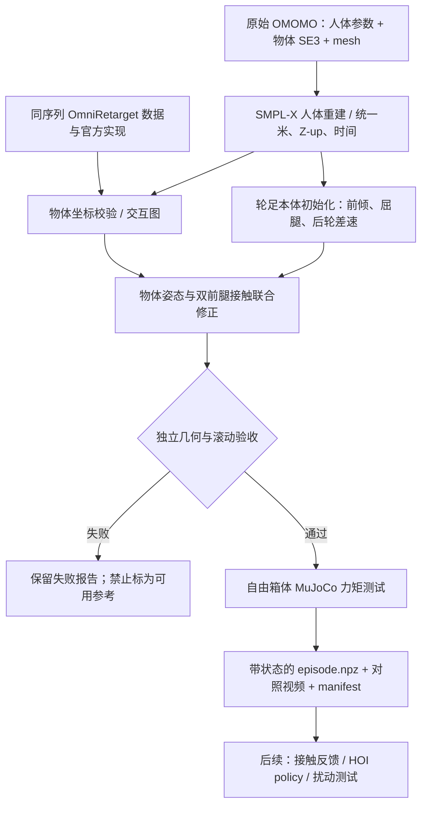

# 人类 HOI → OmniRetarget 交互表示 → bi-wheel ped 参考工作流

目标是保留“地面接近、双侧夹持、抬升、双轮搬运、落地、松开”的 HOI 关系，并适配 Go2W 的轮足约束。当前入口已经实现并用于 `sub16_largebox_010`；它产出可验收的运动学参考、独立物理压力测试和完整来源记录。尚未完成负载控制器或 RL 策略训练，不能把运动学通过当作真实拿放通过。



## 一键执行

在 `/home/robotennis2025/Documents/ChatGPT/PedHOI` 下运行：

```bash
OPENBLAS_NUM_THREADS=1 python -m pedhoi.run --config configs/omomo_largebox_go2w.json
python -m unittest discover -s tests -v
```

- `--resume`：仅复用配置、输入、代码指纹及阶段产物一致的结果；独立验收重新运行。
- `--skip-render`：跳过渲染，保留重定向、验证和导出。
- `--require-dynamics`：要求动力学认证时返回非零；当前没有通过认证，因此不能借此导出“训练就绪”。
- 输出：`runs/omni_ground_clamp/`。每个阶段日志在 `logs/`，来源与版本在 `manifest.json`，参数在 `config.snapshot.json`。

**范围限制：** 当前阶段窗口和机器人初始化已针对这一条地面拿放序列验证。入口对未验证的序列、帧率、箱体尺寸等显式报错。新序列需要重新确认接触窗口和本体参数，不是把另一条 NPZ 改名后直接套用。push/pull 需要额外的物体接地滑动模式，本次没有声称覆盖。

## 阶段、输入与输出

| 阶段 | 具体实现 | 输出 / 约束 |
|---|---|---|
| 1. 人体 HOI 解析 | `pedhoi/extract.py`；按序列名查找原始 entry，SMPL-X 重建 22 个关节；保存物体完整旋转、位置、尺度 | `human/human_source.npz`、`source.json`；不经过 G1 机器人动作 |
| 2. 轮足初始化 | 原始 `human_biwheel/retarget.py` 的独立输出目录 | `rolling_seed/`；规划差速轮轨迹，积分轮相位，统一 4 倍时间缩放 |
| 3. 地面夹持初始化 | `human_ground_clamp/build.py` | `ground_seed/`；人体躯干前倾、地面拿放、双前轮侧向夹持，后轮始终接地 |
| 4. 物体与交互表示 | `pedhoi/object_prior.py` | `interaction.npz`；校验 Omni/world 坐标，构造物体局部坐标、六个人体节点和八个箱角的 Delaunay 图、Laplacian 与源接触点 |
| 5. 物体约束修正 | `pedhoi/retarget_object.py` | 物体旋转及平面位置、双前腿关节联合优化；物体 z 由旋转后支撑高度和人体离地曲线确定；随后做 120 Hz 接触清理 |
| 6. 独立验收 | `pedhoi/validate_export.py` | 原模型碰撞、双侧间隙和接触法线、关节限位、真实旋转箱底、后轮接触速度；优化目标小不代表自动通过 |
| 7. 真实接触测试 / 导出 | 自由箱体力矩测试 + `validate_export.py` + `render.py` | `physics_report.json`、`episode.npz`、`acceptance.json`、三栏对照视频 |

## 这次具体结合了什么 OmniRetarget

[OmniRetarget 项目](https://omniretarget.github.io/)及其[官方 Holosoma 实现](https://github.com/amazon-far/holosoma)使用交互网格与 Laplacian 保持人与物体/场景的空间关系。本地阅读的实现位于：

- `/home/robotennis2025/G2E-HOI/third_party/holosoma/src/holosoma_retargeting/holosoma_retargeting/src/interaction_mesh_retargeter.py`
- 同目录 `utils.py` 的 `create_interaction_mesh`、`get_adjacency_list`、`calculate_laplacian_coordinates`、`calculate_laplacian_matrix`。
- 本地提交：`80f12213aae718171ee836973b151fa8cdfe7ad3`。

本工作流对这些数学结构作独立实现，增加轮足约束和箱体姿态修正。**没有直接运行官方的 G1 SQP 求解器，也没有继承它的数据认证。** 同序列 OmniRetarget 的 G1 关节角不参与本体重定向；它的物体姿态用于坐标和时间校验。

同一条原始 OMOMO 与 OmniRetarget 物体旋转满足一个固定世界 yaw 变换（约 −159.554°）；全帧旋转对齐残差约 3e−5°。这项检查能发现 wxyz/xyzw、世界坐标或序列错配，不能混用不同坐标系直接画物体。

物体局部交互图有 14 个点：骨盆、躯干、左右肘、左右末端、8 个箱角。先在源物体坐标系构图，再按目标物体尺寸映射，优化机器人对应节点的 Laplacian 残差。侧向夹持点仍投影到 Go2W 可达的靠身体侧上角；保留源手部局部坐标供检查，而不宣称机器狗末端精确复制手腕坐标。

## 物体部分的关键修正

1. **完整 SO(3) 作为目标。** 原始物体的 roll/pitch/yaw 全部进入先验；不再只把 box yaw 设成基座 yaw。Go2W 的接触与可达限制仍会导致误差，优化记录修正前后旋转误差。
2. **旋转后的箱底。** 对半尺寸 `h`、旋转矩阵 `R`，支撑高度为 `sum(abs(R[2,:]) * h)`，箱底为 COM z 减该值。箱子倾斜后不再用固定半高判断是否贴地。
3. **物体局部接触。** 双前轮的接触关系跟随物体坐标系更新，使用真实轮 mesh 和 box 的接触流形/距离验证。机器人和物体不再是分别生成、最后拼到一起。
4. **保留人类离地曲线。** 先用源 mesh 拟合的箱体包围盒及其旋转计算支撑高度，再提取离地间隙并缩放；静置阶段固定物体世界位姿，起止箱底为 0。
5. **显式本体适配。** 当前旋转修正范围参数为 35°，平面位置修正范围 ±6 cm。它们是本条实验的可达性设定，不是 Go2W 硬件规格。完整翻箱还未复现；误差不会被隐藏。
6. **后轮结果不被物体修正破坏。** 第 5 阶段固定基座和双后腿/轮，只联合修改双前腿与物体；独立检查非完整滚动约束。测试还逐帧检查箱体接触法线确实分别朝向左右两侧，避免把两轮碰到同一表面误判成夹持。

## 格式约定与交付状态

| 内容 | 格式 |
|---|---|
| 坐标 / 单位 | 世界 Z-up，米、秒、弧度 |
| 时间 | source 30 Hz / 6.4 s；robot 120 Hz / 25.6 s；保存 `source_time` |
| Robot qpos | 23 维：xyz、wxyz、16 个关节，顺序见 `joint_names` |
| Robot qvel | MuJoCo nv22：平移世界系，浮动基角速度本体系，关节速度 |
| Object pose | xyz 与独立 wxyz；不能把 Omni 的 43 维 qpos 直接当 Go2W qpos |
| Object velocities | 线速度世界系；角速度用 SO(3) 差分，字段 `object_ang_vel_world` |
| 质量 / 摩擦 | 0.5 kg 与场景摩擦为实验假设，不是源物体测量值 |

验收状态分开记录：

- `kinematic_reference_ready`：有限值、限位、双侧接触间隙 <3 mm、非穿透容差 2 mm、箱底贴地、后轮接触速度残差 <3 mm/s、物体姿态误差改善均通过。
- `payload_manipulation_validated`：当前为 false。真实物理回放失败会原样保留，不能用参考动画替代。
- `training_ready`：当前为 false。尚未完成 Isaac 数据适配和 HOI RL 环境；该标志不是开始 RL 实验的前置条件，也不代表参考不可学习。

最终物理回放始终使用自由基座、自由箱体和有界关节力矩，没有物体焊接、mocap、根部外力或逐帧状态重设。三栏视频是运动学对照，字幕明确区分。

## 后续控制 / 训练接口

当前工作流到“带验收状态的参考和物理诊断”结束。下一阶段以箱体相对姿态、双侧法向力/滑移、后轮滚动速度和身体平衡为反馈；失败时区分几何不可达、接触未建立、箱体滑移、底盘跟踪失败，分别回到物体适配、接触控制或轮足规划。可以在此阶段接入原 SJTU 项目的训练入口，开展单序列 HOI RL 可学性实验；传统控制器成功不是 RL 的前置条件。只有策略或控制器完成全片地面拿放及扰动验收后，才允许置 `payload_manipulation_validated=true`。

兼容字段 `root_rot` 沿用旧 GMR 的 xyzw；新接口优先读 `robot_root_quat_wxyz` 与 `object_quat_wxyz`，并遵循 `schema.json`，不能仅凭字段名推断四元数顺序。输入文件、机器人 mesh、SMPL-X 模型及数值依赖版本会进入复现指纹。

距离核验还处理一个数值边界：若没有接触流形、距离标量为 0，但最近点对并不重合，则按最近点间距保守计入间隙。`closed_narrow_phase_contact_fraction` 单独报告，不能把近接触或法线合格解读为已经产生稳定夹持力。

物理报告绑定本次 `reference.npz` 的 SHA-256；轨迹改变或报告来自旧版本时，不会把旧的物理结果挂到新参考上。

## 本条样例的当前结果

- 物体姿态误差（夹持阶段 RMS）：约 60.93° → 33.50°，仍未完整复现大幅翻箱。
- 保守侧向接触间隙最大约 1.70 mm，左右接触法线合格；后轮接触速度残差峰值约 0.813 mm/s。
- 起止箱底高度为 0；关节限位、碰撞容差及四元数检查通过。
- 9 项测试通过。自由箱体闭环仍失败；最终失败时间及原因以绑定当前轨迹 hash 的 `physics_report.json` 为准。
- 三栏对照与数值曲线见 `runs/omni_ground_clamp/comparison.mp4` 和 `validation_summary.png`。
